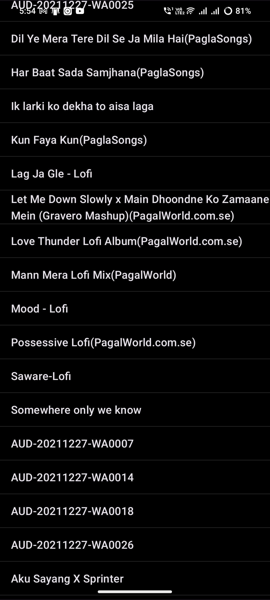
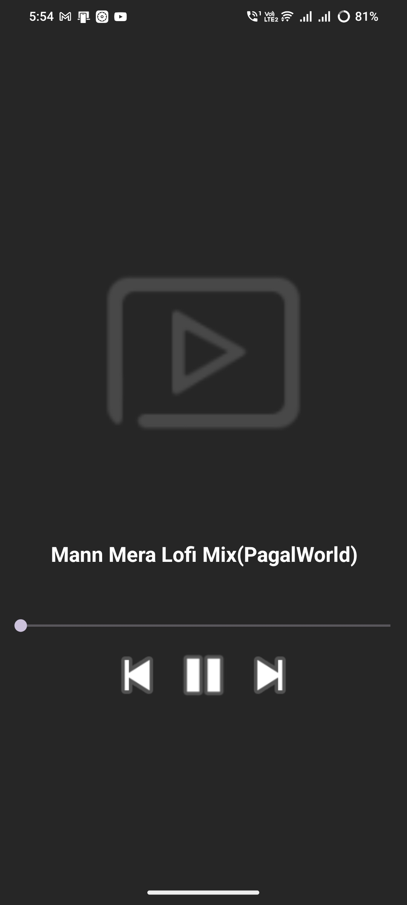

# VibeSphere
### A music app

A music app developed in Java, using Android Studio.
It is the 1.0 version of the app, and it has a lot of things that can be improved. I will work on that, but I don't have enough knowledge. Anyone who can share his or her knowledge i will be glad.

It is my first project that I developed fully in my awareness. I want to improve and make it better. I hope you all will enjoy it.

### Android Version Support 
I tested it on Android 14, 12,11 now its working, but it took some time to respond on older androids

### Permissions used
The only permission that is asked for is to access the audio files, and I will not get any access to your data.

### Sreenshots

### Tech Stack

- Java
- Android Studio
- Dexter (permission handling)

## Future Improvements
* On changing the orientation, it restarts the music.
* In older Android devices, it starts awfully slow.
* The layout needs to be improved.
* Create an uncopyrighted logo.
* minimum height in the listview of an item.
